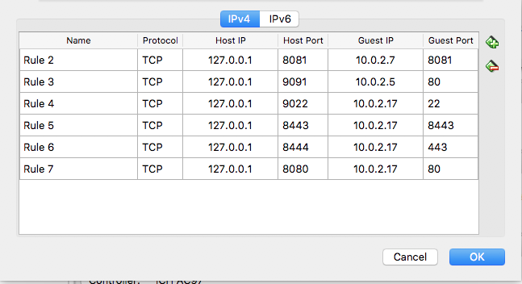

# VirtualBox Notes
Notes for using VirtualBox
### "NAT Network"
Running VMs with “NAT Network” network setting can address VPN issue with VMs.  The [“natdnsproxy1” setting](https://www.virtualbox.org/manual/ch09.html#nat-adv-dns) allows the NAT engine to act as a DNS proxy so that VMs are not interrupted when the host DNS changes (i.e. on/off VPN).  To turn on this option, use the command below.

```
VBoxManage modifyvm "VM name" --natdnsproxy1 on
```
Use port forwarding (to access VMs from host).
The individual VMs can access one another as needed on the NAT network.  Port forwarding can be found via Preferences->Network->NAT Networks->Edit->Port Forwading

Port forwarding: 


### Hardware issues
Running certain programs which may be I/O intensive, such [Kubernetes](https://github.com/coreos/etcd) which includes [etcd](https://github.com/coreos/etcd), on a VM via VirtualBox may require some settings adjustments depending on hardware.  Consider the following:

1. If running on a computer with a solid state drive, try turning on the “Solid-state Drive” option on the hard drive settings.  Some users have reported that this helps some operations.
1. Try using the “Use Host I/O Cache” setting on the hard drive controller.  Depending on needs, this option may help or hinder overall performance of both the host and VM.  In at least one case, it eliminated etcd errors as described [here](https://github.com/coreos/etcd/issues/7507).
